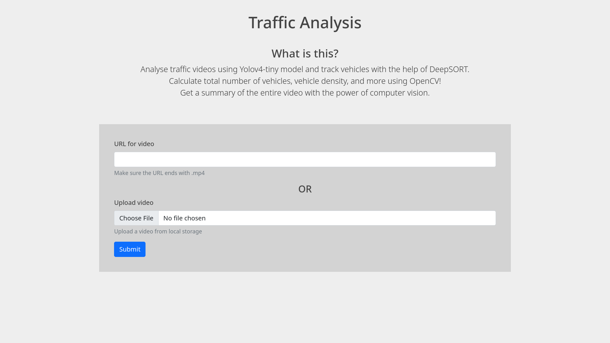
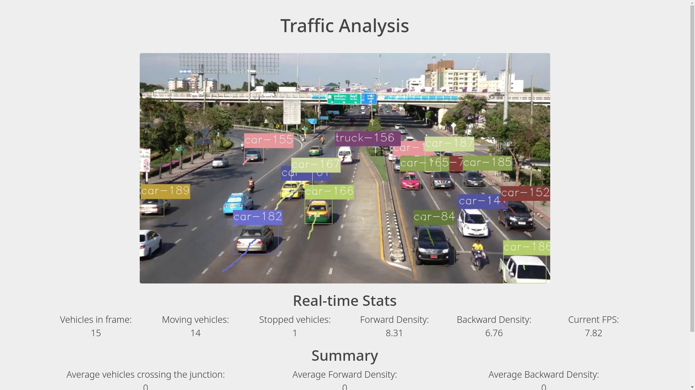
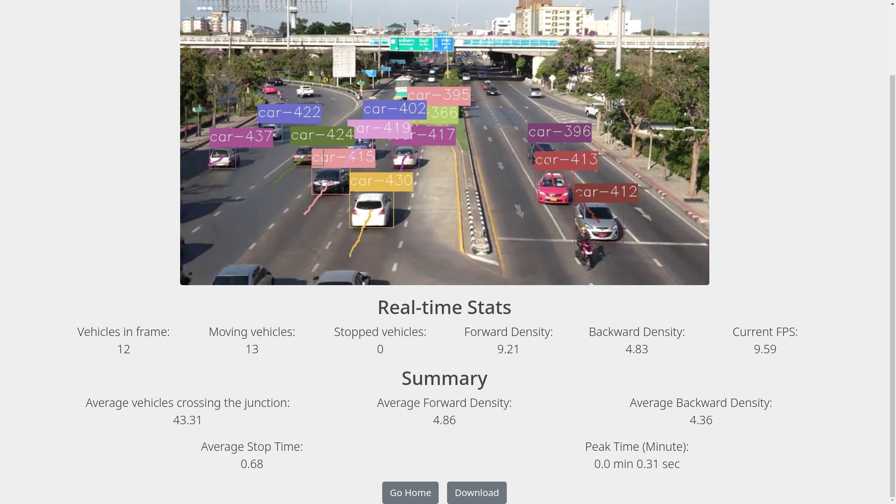

# Traffic-Analysis

Vehicle detection and tracking using deep learning and computer vision.

## Contents

- [Summary](#summary)
- [Installation](#installation)
- [Usage](#usage)
- [Visualization](#visualization)
- [Citations](#citations)

## Summary

Vehicle detection and tracking implemented with YOLOv4 model, DeepSORT, Tensorflow, and OpenCV. The predictions of the YOLOv4 model is fed into the DeepSORT model for realtime tracking. OpenCV is used for processing, displaying and saving the video. The backend for all Deep Learning computations is Tensorflow.

The user will be able to upload either a link, or a video itself, and will be able to get detailed analysis of the video, about the vehicles passing the junction.

The user will be provided with the following real time stats:

- Number of vehicles detected in current frame
- Number of moving vehicles
- Number of stopped vehicles
- Vehicle density in forward lane
- Vehicle density in backward lane
- Current FPS

Along with the above real time stats, a summary will also be shown to the user that consists of the following stats:

- Average number of vehicles that crossed the junction
- Average vehicle density in forward lane
- Average vehicle density in backward lane
- Average stop time in junction
- Peak minute

> NOTE: Density is calculated as the number of vehicles per second

## Installation

Install the required libraries from either the conda config file, or requirements-gpu.txt file.

> NOTE: The config files download libraries for a CUDA enabled GPU hardware. If you're running this on CPU, you might have to tweak some code.

### Conda Environment

```bash
conda env create -f conda-gpu.yml
conda activate yolov4-gpu
```

### Pip Installation

```bash
pip install -r requirements-gpu.txt
```

By default, the YOLOv4-tiny model with input size of 416x416 is used. This model was chosen in order to get high FPS when performing real time analysis. The limitation of this choice is that the model might not be very accurate.

If accuracy is the priority, then please download the YOLOv4 weights from [here](https://drive.google.com/file/d/1cewMfusmPjYWbrnuJRuKhPMwRe_b9PaT/view), convert them from darknet to tensorflow weights, and place them under `./checkpoints/yolov4-416`

Make sure you update [server.py](./server.py) to use the bigger model.

## Usage

1. Start the server locally.

```bash
python server.py
```

2. Go to the server URL. By default, it is `localhost:5000`.

3. Upload either a URL of any .mp4 video, or upload any .mp4 video from your local storage.

4. Submitting the form will redirect to another page that shows all real time stats mentioned in [summary](#summary). The summary stats will be updated once the video is done processing.

5. After the video has been processed, the user may download the processed video which contains bounding boxes and trails.

## Visualization

#### Home Page



#### Real Time Analysis



#### Summary



#### Demo


> NOTE: The above demo is a .gif file. The quality and FPS of the output video will match those of the input video.

## Citations

- [YOLO v4](https://arxiv.org/abs/2004.10934)
- [Deep SORT](https://arxiv.org/abs/1703.07402)
